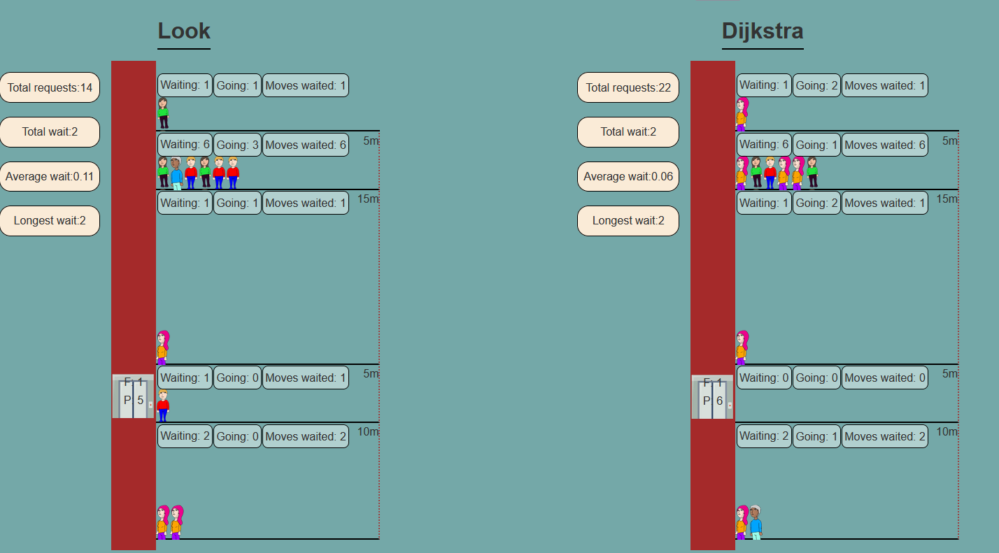

## Elevator algoritme konkurrence
Tre forskellige algoritmer kæmper om at servicere bedst muligt: `Look`, `Shortest Seek First` og `Dijkstra`.

En elevators performance måles i sidste ende i, hvor længe folk har skulle vente på den (opgjort i antal "stop" før de blev betjent). Det er muligt at ændre hvilke algoritme-elevatorer der vises, samt mulighed for at ændre hastigheden for elevatorenes kørsel, hvor hurtigt nye personer skal ankomme og hvor længe simluationen skal vare.

Gruppemedlemmer: Buster Antvorskov (buan0001)

Link til repository: https://github.com/buan0001/smart-elevator-exam-project

Link til deployet udgave https://buan0001.github.io/smart-elevator-exam-project/
 
